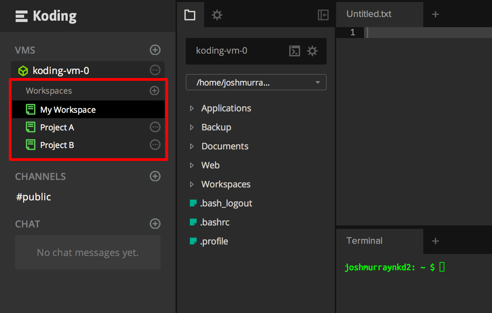

# Workspaces

In this guide we'll go over what [Koding][koding] Workspaces are, and how 
to manage them. Lets get started!

## What are they?

Workspaces are a way to save the arrangement of your IDE. Open Files, 
Terminals, and File Explorer, Workspaces help you save not just what 
you're working on but *how* you're working.

Furthermore, in upcoming releases workspaces will have integration with 
various services and developer tools, making them a quick way to get 
started with a specific type of Project or Service.

## How to use them?



Workspaces, highlighted in the above image, can be opened simply by 
clicking on them. Creating new workspaces is as simple as using the Plus 
button, in the upper right of the highlighted area.

With the workspace open, simply use the [IDE][ide] as you want. Open 
files, Terminals, Browsers, and Drawing Boards will be remembered between 
programming sessions.

## Workspaces on the File System

With each user created Workspace, a directory is created inside the 
`~/Workspaces` directory.

You can open this directory in your Terminal or clone your projects 
directly into it as you like.

## Linking Workspaces to Existing Directories

Workspace folders are just normal folders on the filesystem. As such, as 
can use Unix symbolic links to folders to achieve what we want. As an 
example, lets create a Workspace linked to our Web directory.

Open up a Terminal, and type in the following commands.

```
mkdir -p ~/Workspaces
ln -s ~/Web ~/Workspaces/Web
```

Now, with the Koding UI, create a new workspace named `Web`. That's it!  
Now when you click on the workspace, the FileTree will automatically open 
to the Web folder's contents.

It should be noted that we created our link **before** we created the 
Workspace. If the workspace already existed, the link would not be set 
correctly.

You can freely remove the Workspace filesystem and replace them with any 
links you desire, as the steps above use, but just be careful not to 
delete any of your files in the process.


[koding]: https://koding.com
[ide]: https://koding.com/IDE
