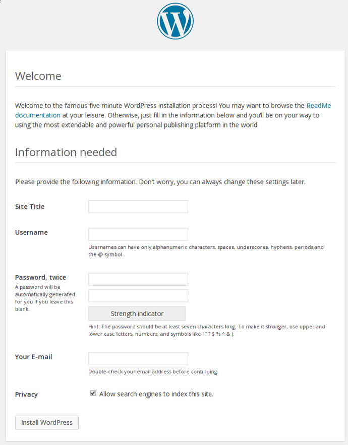

# How to install WordPress

This guide will walk you through the steps required to install WordPress on your Koding VM. We will walk through the steps needed to download, install, configure and eventually run a full WordPress system.

## Step 1 - Database creation

The first thing we need for our WordPress installation to work is a new database. We can create one using either:
1. the command line
2. via [phpMyAdmin](http://learn.koding.com/guides/install-phpmyadmin/).

The rest of this guide will focus on the command line method to create a database for our WordPress installation. (Note: you should already have MySQL installed on your VM before continuing. If you don't have it installed, just follow [this guide](http://learn.koding.com/guides/installing-mysql/) and then come back here to continue with the rest of the WordPress install.)

### setting up MySQL:

Type in the commands listed below in a Koding Terminal.

* Login to mySQL as the root user:

```
mysql -u root -p
```

* Create a new database:

```
CREATE DATABASE wordpress;
```

* Create a new user and assign a password:

```
CREATE USER dbuser@localhost IDENTIFIED BY 'your_password';
```

* Give that user permission to access that database using the following command:

```
GRANT ALL PRIVILEGES ON wordpress.* TO dbuser@localhost;
```

* Apply the changes so that mySQL knows about them:

```
FLUSH PRIVILEGES;

exit
```

## Step 2 - Configuring WordPress

The first thing we need to do is to head over to our Web folder like so type in the following command in Terminal:

```
cd ~/Web
```

Now, we need to download the latest WordPress release. We can do that using the following command:

```
wget http://wordpress.org/latest.zip
```

Unzip the downloaded file:

```
unzip latest.zip
```
All of the wordpress install files will now be extracted into a older named **wordpress** (that you can rename afterwards if you want to).


The last thing we need to do before we can start the installation process is to set up the link between WordPress and the database we created earlier. We can achieve this by typing in the following commands in Terminal:

* Head over to the wordpress folder:

```
cd wordpress
```

* Rename the default config file:

```
cp wp-config-sample.php wp-config.php
```

* Edit the config file via the command line:

```
nano wp-config.php
```

* Add the proper database info into the config file and then save it:

```
// ** MySQL settings - You can get this info from your web host ** //
/** The name of the database for WordPress */
define('DB_NAME', 'database_name');

/** MySQL database username */
define('DB_USER', 'username');

/** MySQL database password */
define('DB_PASSWORD', 'password');

/** Stop WordPress from asking for FTP credentials */
define('FS_METHOD', 'direct');
```

The above variables: *database_name*, *username*, *password* should be replaced with the values you set when creating the database on [Step 1](#step-1).

The last thing that we need to do before we begin the install, is to set up the uploads folder. That can be achieved like so:

* From the command line we create a folder:

```
mkdir wp-content/uploads
```

* We need to give the web server write permission to all WordPress files so you can make changes to the install directly from within WordPress. You can achieve this by using the following commands:

```
sudo chown -R www-data:www-data wp-content/uploads

sudo chmod -R 755 wp-content/uploads
```

## Step 5 - Finalizing the WordPress install

Open up a new browser tab and navigate to your VM's hostname and add **/wordpress** at the end. If you don't know what you VM hostname is, follow [this guide](http://learn.koding.com/faq/vm-hostname/) to find out.

You should see the initial configuration page. It should look like this:



Now you just need to follow the instructions on screen and finish the install!

If you encounter any issues or have any questions regarding WordPress on Koding you can email us at [support@koding.com](mailto:support@koding.com) and we'll gladly help.
