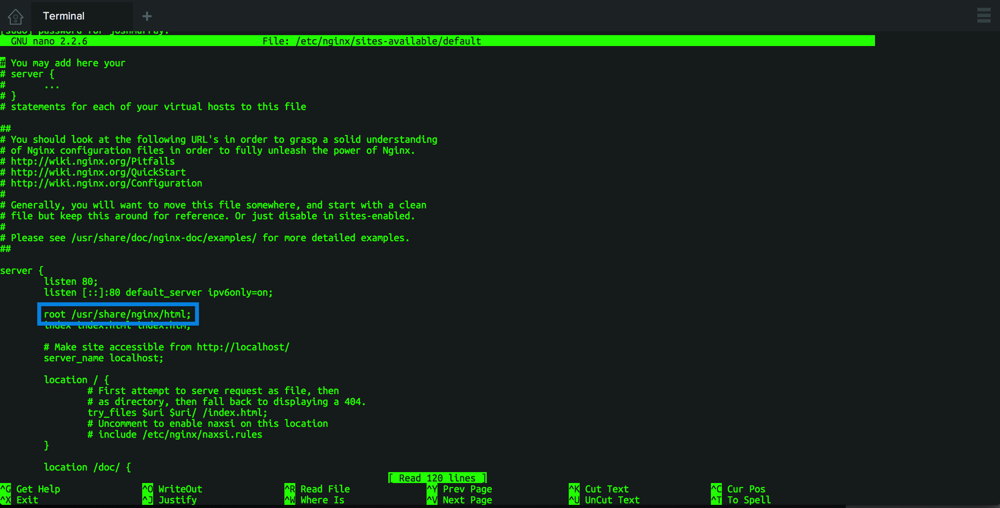

# Installing Nginx

Nginx is an open source proxy server, commonly used as a replace
Nginx is an open source web server. Built with performance and memory usage in 
mind, it's an excellent alternative to Apache. In this guide, we'll go through 
the simple process of installing Nginx on [Koding][koding]. Lets get started!


## Installing Nginx

Koding runs Ubuntu, gives you root, and of course comes with apt-get. This 
means that installation of many packages, programs and servers simply 
require using apt-get. To install Nginx with apt-get, run the following 
command.

```
sudo apt-get install nginx
```

Confirm the installation by pressing enter at the **[Y/n]** prompt, and proceed 
to the next step.

## Starting Nginx

Your Virtual Machine comes with Apache preinstalled and configured. It's 
what serves up the web page that you see when you visit 
`http://hostname.username.koding.io`. So before we start Nginx, we have 
to stop Apache with the following command.

```
sudo service apache2 stop
```

You can then start your Nginx server by using the following command.

```
sudo service nginx start
```

If you now visit your User *(or VM)* domain at 
`http://hostname.username.koding.io`, you'll see a welcome to nginx page 
like the one below. This means your Nginx server is up and running.


## Using ~/Web

Your Nginx server is running, but it's not serving up the files that you expect 
from your `~/Web` directory. To do this we need to edit out 
`/etc/nginx/sites-available/default` file with a Terminal editor such as Nano 
or Vim. In this example we'll use Nano for simplicity.

Open up your [Terminal][terminal] and run the following command.

```
sudo nano /etc/nginx/sites-available/default
```

You'll see a bunch of green text, similar to the following image. What we're 
looking to edit is the text `root /usr/share/nginx/html`, as seen highlighted 
in this image:



Using your arrow keys, navigate to the end of the `/usr/share/nginx/html` text 
and delete the entire folder name *(with your backspace key)*. Replace it with 
the folder `/var/www`.

```
    root /var/www
```

By doing this, you're changing the directory of files that nginx is serving by 
default. `/var/www` is the default Apache dir, and is soft-linked to `~/Web`. 
In short, we're telling Nginx to use what we currently use.

After you've made the appropriate edits, use `Ctrl-X` to close Nano. You'll be 
prompted with a `Y/n` question to save the file. Type `y`. Next you'll be 
prompted for the filename to save it, press `Enter`, as the filename field is 
already filled out.

Now all we have to do is restart our web server!

```
sudo service nginx restart
```

If you visit your domain again you'll see the same `~/Web` files that you are 
familiar with. You now have an Nginx server up and running, and serving your 
Web files. Enjoy!


[koding]: https://koding.com
[terminal]: https://koding.com/Terminal
