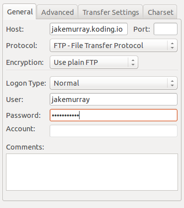

# Setting up FTP on Koding

In this guide we'll go over how to get your FTP Client connected to your 
VM's FTP Server. We will be using [FileZilla][filezilla] as the FTP 
Client, but any client should be able to connect to your FTP Server 
successfully.

## What you will need

In this tutorial you will need the following.

1. A [Koding][koding] account, and your Koding Username.
2. The Address of the VM you'd like to connect to. Instructions can be 
[found here][vm address].


## Installing PureFTPd

First off, we'll need to install PureFTPd. This can be done by pasting 
the following command into your [Koding IDE][ide]'s Terminal.

```
sudo apt-get install pure-ftpd
```

## Adding an FTP User

After PureFTPd has been successfully installed, we need to add an FTP 
username and password to connect to. These have nothing to do with Koding 
username and password, and are simply used for ftp authorization. To do 
this, paste the following command into your Terminal.

```
sudo pure-pw useradd FTP_USERNAME -u KODING_USERNAME -d ~/Web
```

Make note to replace `FTP_USERNAME` with the FTP username you want to 
use, and `KODING_USERNAME` with your actual Koding Username.

After hitting enter, you'll be prompted for the **FTP** password you wish 
to use. *Not* your Koding password.

## Linking Your FTP Database

Next, you'll have to run a few commands to get the ftp database setup and 
configured properly. Run the following commands in your Terminal.

```
sudo pure-pw mkdb
sudo ln -s /etc/pure-ftpd/pureftpd.passwd /etc/pureftpd.passwd
sudo ln -s /etc/pure-ftpd/pureftpd.pdb /etc/pureftpd.pdb
sudo ln -s /etc/pure-ftpd/conf/PureDB /etc/pure-ftpd/auth/PureDB
```

Once the above is ran, simply restart your now-configured FTP Server.  
This can be done with the following command.

```
sudo service pure-ftpd restart
```

## Connecting to your FTP Server

Finally, in your FTP Client of choice paste your VM Address into the 
hostname. If you're not sure what that is, instructions to find it can be 
[found here][vm address].

After the Hostname, enter your FTP Username, and FTP Password that you 
chose in the above commands. An example image from FileZilla can be seen 
below.




## Additional Resources

- [FileZilla](https://filezilla-project.org/)
- [FileZilla Download](https://filezilla-project.org/download.php?type=client)


[filezilla]: https://filezilla-project.org/
[download]: https://filezilla-project.org/download.php?type=client
[koding]: https://koding.com
[ide]: https://koding.com/IDE
[vm address]: /faq/vm-address
