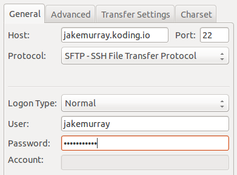

# Setting up SFTP on Koding

In this guide you'll go over how to get your SFTP Client connected to your VM's SFTP Server. You will be using [FileZilla][filezilla] as the SFTP Client, but any client should be able to connect to your SFTP Server successfully.

## What you will need

In this tutorial you will need the following.

1. A [Koding][koding] account, and your Koding Username.
2. The Address of the VM you'd like to connect to. Instructions can be [found here][vm address].

## Update your software sources
Before getting started, make sure you have the latest sources locked down. Type in:

```
sudo apt-get update
```

and let the update process complete. It should not require any input.

## Installing

First off, you'll need to install `openssh-server`. This can be done by pasting the following command into your [Koding IDE][ide]'s Terminal.

```
sudo apt-get install openssh-server
```

## Configure

After the install process has finished you'll need to configure the SFTP server. Start by editing the following file `/etc/ssh/sshd_config` like so:

```
sudo nano /etc/ssh/sshd_config
```

Find the below line:

```
Subsystem sftp /usr/lib/openssh/sftp-server
```

and replace it with:

```
Subsystem sftp internal-sftp
Match group ftpaccess
ChrootDirectory %h
X11Forwarding no
AllowTcpForwarding no
ForceCommand internal-sftp
```

finally comment the below line:

```
#UsePAM yes
```

After you have performed this steps you'll need to restart the service using this command:

```
sudo service ssh restart
```

## Setting up the SFTP user

After the configure process has been completed, You need to set a SFTP password for your user. To do this, paste the following command into your Terminal.

```
sudo passwd KODING_USERNAME
```

Make note to replace `KODING_USERNAME` with your actual Koding username.

After hitting enter, you'll be prompted for the **SFTP** password you wish to use. *Not* your Koding password.

## Connecting to your SFTP Server

Finally, in your SFTP Client of choice paste your VM Address into the hostname. If you're not sure what that is, instructions to find it can be [found here][vm address].

After the Hostname, enter your Koding username, and SFTP password that you chose in the above commands. An example image from FileZilla can be seen below.



## Additional Resources

- [FileZilla](https://filezilla-project.org/)
- [FileZilla Download](https://filezilla-project.org/download.php?type=client)


[filezilla]: https://filezilla-project.org/
[download]: https://filezilla-project.org/download.php?type=client
[koding]: https://koding.com
[ide]: https://koding.com/IDE
[vm address]: /faq/vm-address
