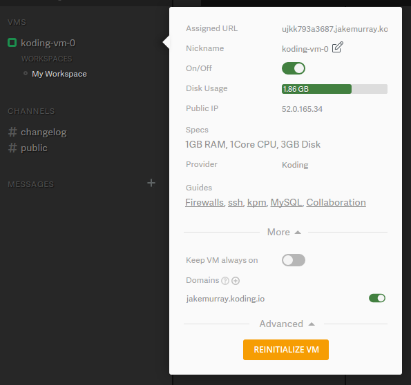

# Understanding the VM settings panel

This guide will explain the basics of the VM settings panel.

In order to open the VM settings panel you need to hover over the VM name on the right side of Koding (in the sidebar at the top) and then click on the little three points icon on the right, as picture above. 

After you clicked on the icon mentioned above the VM modal should open and it should look like the one pictured above.

The VM settings panel has three main section: Basic section, the More section and the Advanced section.

## Basic section

The basic section includes basic information about your VM and some basic functionality over it. Each line is explained below.

* Assigned URL. This is the long assigned URL of your Koding VM.
* Nickname. You can rename your VM and this will update the name that appears in the right sidebar.
* On/Off toggle. The current status of the VM. You can also turn off your VM from here, though we don't recommend it.
* Public IP. Your VMs public IP. If you are a free user this will change, but if you're a paying customer this will remain the same.
* Specs. What specifications does your VM have. This is based on your current plan.
* Provider. Who's your VM provider. In the future you will be able to choose from multiple providers.
* Guides. What are the most common and useful guides to get you started with your VM.

## More section

The more section includes some additional settings for your VM. Each setting has been explained below.

* Keep VM always on toggle. If you are a paying customer than you can chose to keep your VM always on. This means that the 60 min restriction will not be applied to your VM.
* Domains. You can enable a [short URL for your VM and/or define subdomains](http://learn.koding.com/faq/vm-hostname/) and [custom domains for your VM](http://learn.koding.com/guides/domains/).

## Advanced section

The advanced section includes settings that only advanced users should use. If you are an unexperienced user then this section should be of limits.

* Reinitialize VM. This button will bring your VM to it's default state. This means that everything will be reverted to it's default state and every file in your home folder will be removed. 
* Terminate VM. If you're a paying customer you can choose to remove your VM and create a new one if you so choose.

If you encounter any issues or have any questions regarding the VM settings panel you can email us at [support@koding.com](mailto:support@koding.com) and we'll gladly help.

