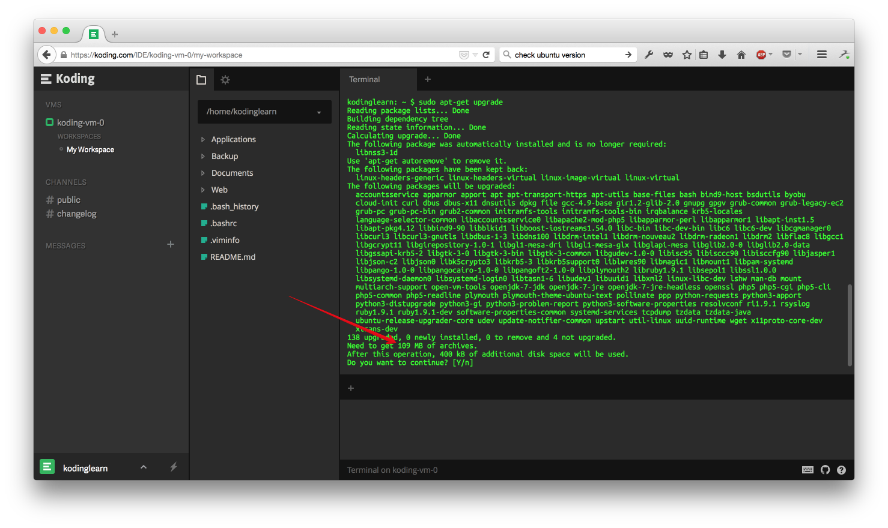
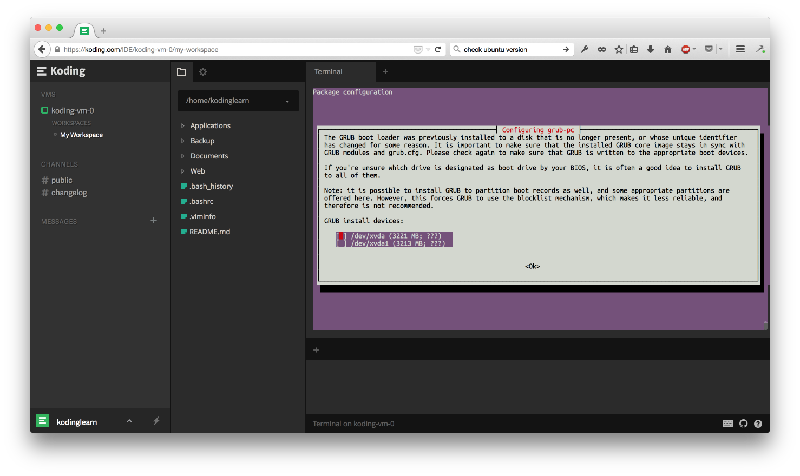
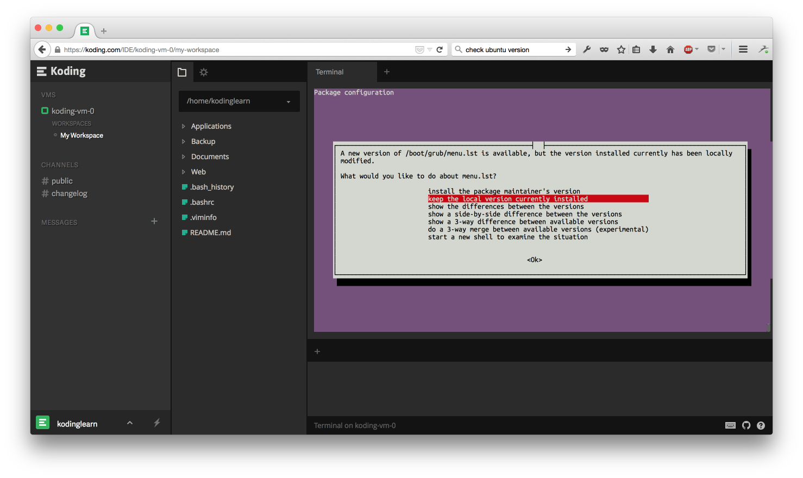
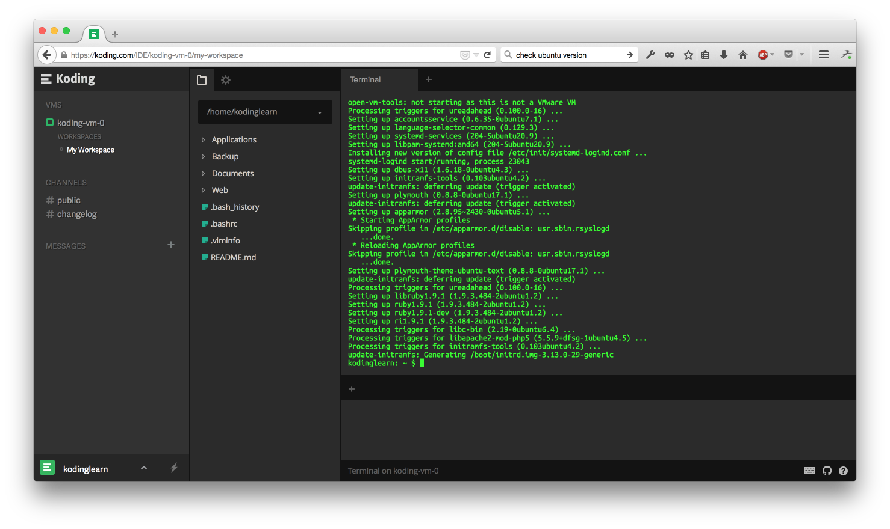
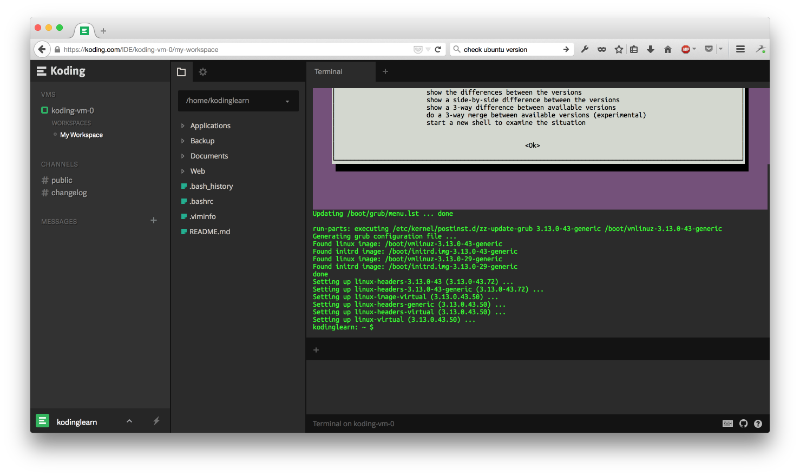

# Updating the OS on your Koding VM

This guide will walk you through the process of upgrading the OS, Kernel and core packages on your Koding VM.

We will walk through the following steps:
1. upgrading the packages (strictly upgrade the current packages)
2. upgrading the distribution/OS (install newly released packages)

So depending on your need, you can do 1) or 2) or both.

*Note: Even though we have tested upgrading the VM, some updates may render your VM inaccessible so
please proceed only if you know what you are doing. If you run into problems, you can always 
re-init your VM or send us a request via [support@koding.com](mailto:support@koding.com).*


### A few prep commands
To get started, log into your Koding account and check what version of the OS and Kernel that
you currently have by typing the following command in Terminal:
```
uname -rv
```
this should return you something like this:
```
3.13.0-29-generic #53-Ubuntu SMP Wed Jun 4 21:00:20 UTC 2014
```
Make a note of the kernel version, you can reference it later to ensure that the kernel upgrade
worked.

You should also take a note of available disk space before you begin to ensure that you have adequate
space for all the upgrades. To get available disk space, type this command in Terminal:
```
df -h
```
and you should get back a result that looks similar to:
```
Filesystem      Size  Used Avail Use% Mounted on
/dev/xvda1      2.9G  1.6G  1.2G  57% /
none            4.0K     0  4.0K   0% /sys/fs/cgroup
udev            492M  8.0K  492M   1% /dev
tmpfs           100M  324K   99M   1% /run
none            5.0M     0  5.0M   0% /run/lock
none            497M     0  497M   0% /run/shm
none            100M     0  100M   0% /run/user
```
notice the number in line one, column "Avail"... that is the amount of disk space you have available.

Before beginning, you should update the list of available packages, this ensures that all upgrades
performed are against the latest levels available on the Ubuntu upgrade servers.

To update your package list, type the following command in Terminal:
```
sudo apt-get update
```
Note: nothing has been upgraded at this time, just the list of available packages has been updated.

### Upgrading existing packages
These series of commands will upgrade all _existing_ packages. These will NOT install new packages.

To update all currently installed packages  to their latest levels, issue the following command in
Terminal:
```
sudo apt-get upgrade
```
The system will analyze which packages on your VM need an upgrade and will give you an estimate
of the space needed. Make sure that the number shown here is less than the number you saw earlier
when you checked for available disk space. To be sure, add an extra 100MB to the number `apt-get`
is telling you. If you run out of disk space during the install, you will render your VM unusable
so proceed with extreme caution and double check that you have space available.


If you have space, answer `Y` to the question and let the upgrades start. If you don't have enough
space, press `ctrl-c` to cancel the upgrade and try to free up space by deleting files that you don't
need before starting again.

After several screens fly by, you may end up with a screen that looks like this:

Using your arrow keys and space bar, select both options. Hit `tab` key to move to "ok" and then press
enter to continue.

A few screens later, you may encounter the following:

Leave the pre-selected option ("keep the local version currently installed") as-is, hit `tab` to move
to "ok" and then press enter to continue.

If all went well, you will end up on a screen that looks like this and the cursor is at the command
prompt again:


Congratulations! You have just finished upgrading your existing packages to their latest official 
released levels. This will also include officially released security patches for all existing
software packages.

If you just wanted to upgrade, you can stop now. If you also wish to update your Ubuntu distribution,
 then you can continue to the next section.
 
### Upgrading your Ubuntu Distribution
This command will install new packages that have been released for Ubuntu. As before, please make
sure that you have re-checked the available disk space before proceeding.

Type in the following command to begin the update process:
```
sudo apt-get dist-upgrade
```
The command will pull in new versions of the Linux Kernel (if any are available). Just like before,
if you encounter any screens that ask for overwriting existing files, please follow the recommendations
from the previous section. Once done, you should see something like this:


Now, let's reboot the VM. Open up the settings panel for your VM and toggle the on/off switch. Once 
the VM turns off and you see the button to turn it on, go ahead and click it. This is necessary
to ensure that the updated files are brought into use.

Now if you type in the following command in Terminal:
```
uname -rv
```
you should see output as the following:
```
3.13.0-43-generic #72-Ubuntu SMP Mon Dec 8 19:35:06 UTC 2014
```
note that the kernel version has updated. You've just updated your VM to the latest Linux
kernel!

### If something goes wrong
Your Koding VM can easily be reinitialized to our official version (the version you got when you 
made a new Koding account) so if all these upgrades leave you with an unusable VM, try [reinitializing
your VM back to its original state](http://learn.koding.com/faq/vm-reinit/).
