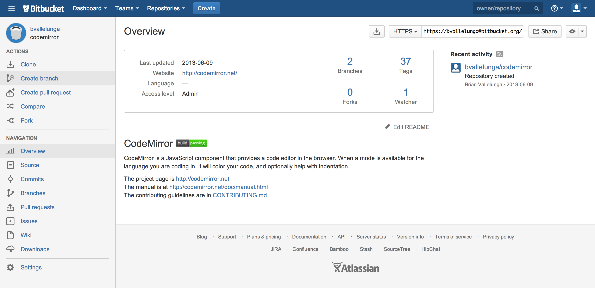

# What is Bitbucket?

Bitbucket provides Git and Mercurial hosting for teams.
Host your code online in as many public and private repositories as you want. Free five-user tier accounts!
Manage your projects with confidence with built-in issue trackers, wikis, code comments, and pull requests.

# Setup SSH for Git

If you already have ssh keys, then please skip this step.
Please follow this excellent guide by Atlassian on how to [setup
ssh keys](https://confluence.atlassian.com/display/BITBUCKET/Set+up+SSH+for+Git). 


# Selecting a Repository from Bitbucket

Now that you have setup ssh, it is time select a repository from Bitbucket.
When signing into Bitbucket you will be presented with a list of repositories.


For this guide I am going to choose the `codemirror` repository




# Getting the SSH Clone Url

In the repository dashboard you will see a panel in the upper right corner.
Set the url to `ssh` and copy the url.


# Clone the Repository

Good Job so far! Now lets clone the repository into your `~` folder

```
$ git clone git@bitbucket.org:bvallelunga/codemirror.git
```

Once git is finished cloning, your terminal will look like this

```
$ git clone git@bitbucket.org:bvallelunga/codemirror.git
Cloning into 'codemirror'...
Enter passphrase for key '/home/bvallelunga/.ssh/id_rsa': 
remote: Counting objects: 13109, done.                                                                                                                                                                       
remote: Compressing objects: 100% (5060/5060), done.                                                                                                                                                         
remote: Total 13109 (delta 8025), reused 13109 (delta 8025)                                                                                                                                                  
Receiving objects: 100% (13109/13109), 2.78 MiB | 717 KiB/s, done.
Resolving deltas: 100% (8025/8025), done.
```

# Verify the Repository Exists

The last step is to verify that the cloning proccess was successful.
To do this, get the directory listing and check to see if your intended folder exists.

```
$ ls
Applications  codemirror  Documents  Uploads  Web
```

As you can see, the `codemirror` folder exists. Thank you and have a wonderful Koding day!
