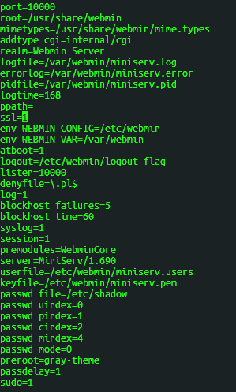

#Installing Webmin on your Koding VM

## The Details
This guide will cover the installation of Webmin on your Koding Virtual Machine. Webmin is a web-based adminstration tool for Unix based operating systems. 
This tool will allow you to modify and control applications like Apache, and view/modify your MySQL DBs. Webmin also allows you to modify other system tools 
from the web like users, passwords, iptables, log file rotations and more! If you'd like to read more about Webmin, you can check out their website [here](http://webmin.com).


## Downloading and installing Webmin

Alright, first thing's first, we want to add the webmin team's repo to our apt sources. Run the following command to open apt's source list for editing.


```
sudo vi /etc/apt/sources.list
```


Press **i** to enter the vi input mode to edit the list. Add the following to the bottom of the file.


```
deb http://download.webmin.com/download/repository sarge contrib
```

It should look like below when you are done.


After adding this line press **ESC** to exit input mode. Then type **:wq** to write(save) and quit the file.

Now that apt has the source, lets run the following command to download and install the key needed for webmin.


```
wget -q http://www.webmin.com/jcameron-key.asc -O- | sudo apt-key add -
```


We can now update apt, and install Webmin. You can use the following commands.


```
sudo apt-get update

sudo apt-get install webmin
```

You will be prompted if you want to continue, press **Y **to accept.


Once the install is complete, you will see the following as the final output:


Make note of the url given here as you will need it to access Webmin once it is setup.

##Configuration

Congratulations! Webmin is now installed on your Koding VM. We only have a few things left to do before it is useable. We need to change the SSL setting in the miniserv config file from **1** to **0**. Enter the following command to open the config file for editing.

```
sudo vim /etc/webmin/miniserv.conf
```
	
Once the file is open press **i** to enter input mode. Use the arrow keys to navigate to the line **SSL=1** change this line to read **SSL=0**. Again, hit **ESC** and type **:wq** to write(save) and quit the file.

The file should look like below before editing. 



In order to apply the changes we have made to the configuration, we will need to restart the webmin service. To do that enter the following command.

```
sudo service webmin restart
```

You've done it! Webmin is installend and configured!

## Logging In

Navigate to the URL you took note of earlier.
To login to webmin, you can use the root user + your Koding password.


